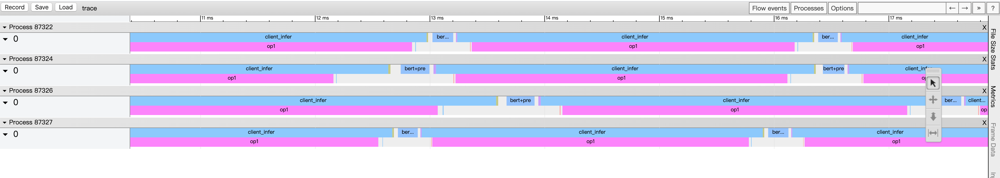

(简体中文|[English](./README.md))

paddle_serving_app是Paddle Serving框架的工具组件，包含了预训练模型下载、数据预处理方法等功能。方便用户快速体验和部署模型示例、分析预测服务性能、调试模型预测服务等。

## 安装

```shell
pip install paddle_serving_app
```

## 获取模型列表

```shell
python -m paddle_serving_app.package --list_model
```

## 下载预训练模型

```shell
python -m paddle_serving_app.package --get_model senta_bilstm
```

paddle_serving_app中内置了11种预训练模型，涵盖了6种预测任务。获取到的模型文件可以直接用于部署，添加`--tutorial`参数可以获取对应的部署方式。

| 预测服务类型 | 模型名称                                         |
| ------------ | ------------------------------------------------ |
| 中文情感分析 | 'senta_bilstm', 'senta_bow', 'senta_cnn'         |
| 语义理解     | 'ernie'                                          |
| 中文分词     | 'lac'                                            |
| 图像检测     | 'faster_rcnn'                                    |
| 图像分割     | 'unet', 'deeplabv3', 'deeplabv3+cityscapes'                              |
| 图像分类     | 'resnet_v2_50_imagenet', 'mobilenet_v2_imagenet' |

## 数据预处理API

paddle_serving_app针对CV和NLP领域的模型任务，提供了多种常见的数据预处理方法。

- class ChineseBertReader 
  
    中文语义理解模型预处理

  - `__init__(vocab_file, max_seq_len=20)`

    - vocab_file（str）：词典文件路径。

    - max_seq_len（int，可选）：处理后的样本长度，超出的部分会截断，不足的部分会padding 0。默认值20。

  - `process(line)`
    - line（str）：输入文本

  [参考示例](../../examples/C++/PaddleNLP/bert/bert_client.py)

- class LACReader 中文分词预处理

  - `__init__(dict_floder)`
    - dict_floder（str）词典文件目录
  - `process(sent)`
    - sent（str）：输入文本
  - `parse_result`
    - words（str）：原始文本
    - crf_decode（np.array）：模型预测结果中的CRF编码

  [参考示例](../../examples/C++/PaddleNLP/lac/lac_http_client.py)

- class SentaReader

  - `__init__(vocab_path)`
    - vocab_path（str）：词典文件目录
  - `process(cols)`
    - cols（str）：分词后的文本

  [参考示例](../../examples/C++/PaddleNLP/senta/senta_web_service.py)

- 图像的预处理方法相比于上述的方法更加灵活多变，可以通过以下的多个类进行组合，[参考示例](../../examples/C++/PaddleClas/imagenet/resnet50_rpc_client.py)

- class Sequentia

  - `__init__(transforms)`
    - transforms（list）：图像预处理方法类的列表
  - `__call__(img)`
    - img：图像处理的输入，具体类型与transforms中的第一个预处理方法有关

- class File2Image

  - `__call__(img_path)`
    - img_path（str）：图像文件路径

- class URL2Image

  - `__call__(img_url)`
    - img_url（str）：图像url

- class Normalize

  - `__init__(mean,std)`
    - mean（float）：均值
    - std（float）：方差
  - `__call__(img)`
    - img（np.array）：（C,H,W）排列的图像数据

- class CenterCrop

  - `__init__(size)`
    - size（list/int）：预期的裁剪后的大小，list类型时需要包含预期的长和宽，int类型时会返回边长为size的正方形图片
  - `__call__(img)`
    - img（np.array）：输入图像

- class Resize

  - `__init__(size, max_size=2147483647, interpolation=None)`
    - size（list/int）：预期的图像大小，list类型时需要包含预期的长和宽，int类型时，短边会设置为size的长度，长边按比例缩放
  - `__call__(img)`
    - img（numpy array）：输入图像

## Timeline 工具

通过Timeline工具可以将预测服务的准备数据、client等待、server端op等各阶段起止时间可视化，方便分析预测服务中的时间占用比重，在此基础上有针对性地优化预测服务。

### 使用方式

1. client端在进行预测之前，通过环境变量打开Paddle Serving框架中的各阶段日志打点功能

   ```shell
   export FLAGS_profile_client=1 #开启client端各阶段时间打点
   export FLAGS_profile_server=1 #开启server端各阶段时间打点
   ```

2. 执行预测，并将client端的日志重定向到文件中，例如profile文件。

3. 将日志文件中的信息导出成为trace文件

   ```shell
   python -m paddle_serving_app.trace --profile_file profile --trace_file trace
   ```

4. 使用chrome浏览器，打开`chrome://tracing/`网址，通过load按钮加载上一步产生的trace文件，即可将预测服务的各阶段时间信息可视化。

   效果如下图，图中展示了使用[bert示例](../../examples/C++/PaddleNLP/bert)的GPU预测服务，server端开启4卡预测，client端启动4进程，batch size为1时的各阶段timeline。
其中bert_pre代表client端的数据预处理阶段，client_infer代表client完成预测请求的发送到接收结果的阶段，图中的process代表的是client的进程号，每个进程的第二行展示的是server各个op的timeline。

   

## Debug工具

Paddle Serving框架的server预测op使用了Paddle 的预测框架，在部署预测服务之前可能需要对预测服务的输入输出进行检验或者查看资源占用等。因此在paddle_serving_app中内置了本地预测工具，使用方式与通过client向服务端发送请求一致。

以[fit_a_line预测服务](../../examples/C++/fit_a_line)为例，使用以下代码即可执行本地预测。

```python
from paddle_serving_app.local_predict import LocalPredictor
import numpy as np

debugger = LocalPredictor()
debugger.load_model_config("./uci_housing_model", gpu=False)
data = [0.0137, -0.1136, 0.2553, -0.0692, 0.0582, -0.0727,
        -0.1583, -0.0584, 0.6283, 0.4919, 0.1856, 0.0795, -0.0332]
fetch_map = debugger.predict(feed={"x":data}, fetch = ["price"])
```
